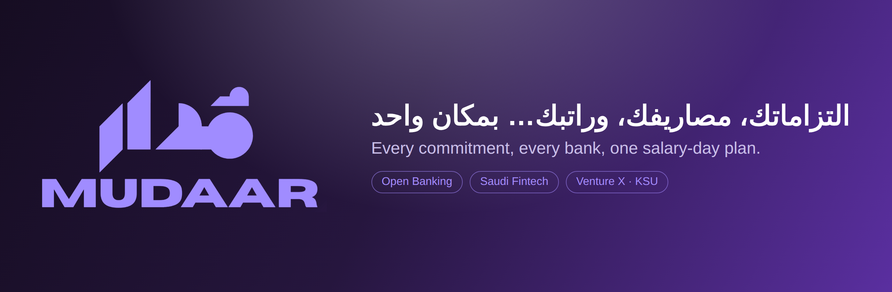
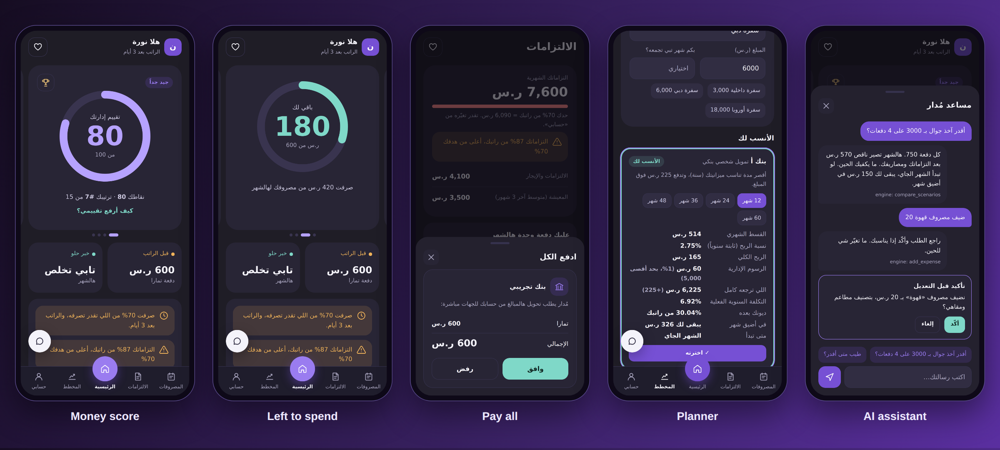
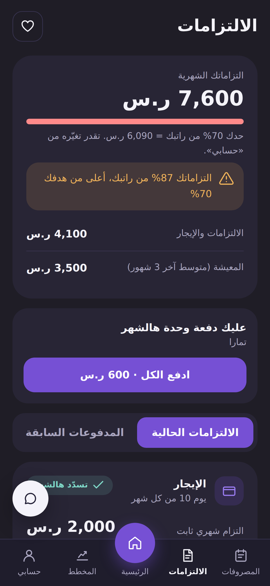
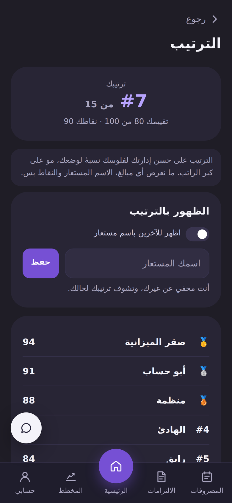
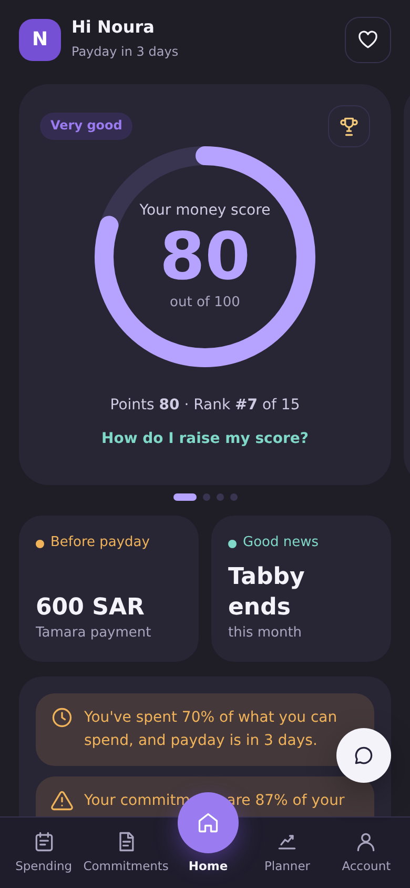
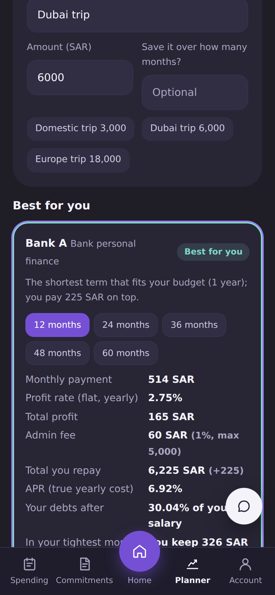
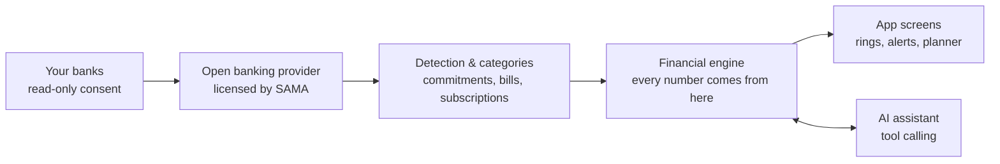

<p align="center">
  
</p>

<p align="center">
  
  
  
  
  
</p>

<div dir="rtl" align="right">

**مُدار** يربط كل حساباتك البنكية، يكتشف التزاماتك واشتراكاتك تلقائياً، ويقولك كم تقدر تصرف، ومتى، وبأي طريقة تدفع — قبل لا تنسحب دفعة قبل راتبك.

</div>

**Mudar** is a mobile-first personal finance app for Saudi Arabia. It connects every bank account through open banking, finds every installment, bill and subscription, and plans the whole month around payday: what you can still spend, what's due before salary, and the cheapest way to pay for anything you're planning.

> Built for the **Venture X challenge at King Saud University** (Open Banking & Fintech track). The demo runs on simulated bank data; every calculation is real and covered by automated tests.

<p align="center">
  
</p>

---

## Why

| | |
| --- | --- |
| **85%** | of retail payments in Saudi Arabia were electronic in 2025 ([SAMA](https://www.sama.gov.sa/en-us/mediacenter/news/pages/news-1139.aspx)) |
| **10M** | registered BNPL customers in 2022, up from 76K in 2020 ([SAMA Fintech Report via Argaam](https://www.argaam.com/en/article/articledetail/id/1668759)) |
| **SAR 481B** | in bank consumer loans, Q1 2026 ([Argaam](https://www.argaam.com/en/article/articledetail/id/1918899)) |

People pay installments, bills and subscriptions to many providers across several banks. Each app sees only its own slice, so nobody sees the month against the salary. Our demo persona, Noura, earns SAR 8,700 on the 27th; her Tamara installment is debited on the 25th, two days before payday, and only **SAR 180** is really left for the rest of the month.

## Features

| | Feature | What it does |
| --- | --- | --- |
| 🏦 | **Every bank, one picture** | Connect several banks; commitments and subscriptions are detected automatically, with the bank shown on every transaction |
| 🔔 | **No surprises** | Alerts for payments due before payday, and reminders before any subscription renews |
| 🎯 | **Left to spend** | One number: salary − commitments − usual living costs − safety buffer, per salary cycle |
| 🧭 | **Planner** | Phone, trip, wedding or course: compares BNPL, bank and finance-company loans and saving up, and recommends the cheapest you can start within a month |
| 💳 | **Pay all** | Pay this month's installments in one flow via bank approval (simulated open-banking payment initiation) |
| 🏆 | **Fair money score** | A 0–100 score from 6 ratio-based measures, points for good actions, and opt-in standings with nicknames only |
| 💬 | **AI assistant** | Chat in Saudi Arabic or English; it calls the engine through tools and asks before changing anything |
| 🌐 | **Arabic & English** | RTL Arabic by default, full English LTR mode, light and dark themes, installable as a PWA |

<details>
<summary><b>More screens</b></summary>
<br>
<p align="center">
  
  
  
  
</p>
</details>

## How it works



**The rule behind everything: the engine calculates, the AI explains.** The language model never does arithmetic; it picks a tool, the engine returns exact numbers, and the model explains them. It only ever sees totals, never transactions or account numbers.

### The engine in six algorithms

1. **Commitment detection**: same payee, same amount (±2%), every 27–33 days. A sequence like `2/4` in the bank description gives the payments left. Four validation checks, then the user confirms.
2. **Left to spend**: `salary − commitments due − 3-month living average − safety buffer`, computed per salary cycle, not calendar month.
3. **Purchase simulation**: every payment is subtracted from every coming month; a plan fits when the tightest month stays ≥ 0. Start dates from now to 24 months ahead are tried.
4. **Best option**: cheapest option you can start within a month. Loans use flat profit, a 1% admin fee capped at SAR 5,000, true APR, and a 33.33% salary-deduction limit ([SAMA responsible lending principles](https://rulebook.sama.gov.sa/en/entiresection/1402)).
5. **Fair score**: six measures that are all ratios of the user's own salary and targets. A test multiplies every amount by 4 and checks the score doesn't change.
6. **Assistant tools**: read tools answer questions; write tools create a pending request that expires in 10 minutes unless the user confirms.

<details>
<summary><b>Worked example with Noura's numbers</b></summary>

| | Calculation |
| --- | --- |
| Left to spend | 8,700 − 4,100 − 3,500 − 500 = **600**; spent 420 → **180 left** |
| Phone, 3,000 in 4 payments | Now: 180 − 750 = **−570** ✗ · Next month (Tabby ends): 900 − 750 = **150** ✓ |
| 6,000 loan for 12 months | Profit 165 + fee 60 → **514/month**, APR ≈ 6.92% · 60 months would cost 885 extra instead of 225 |
| Debt burden after the loan | (2,100 + 514) ÷ 8,700 = **30%** < 33.33% ✓ |
| Money score | 25 + 20 + 6 + 12 + 7 + 10 = **80 / 100** |

</details>

## Tech stack

| Layer | Technology |
| --- | --- |
| Backend | Python, FastAPI |
| Database | SQLite (demo) |
| Frontend | Vanilla HTML/CSS/JS, PWA, RTL/LTR |
| AI | Anthropic API with tool calling, plus an offline rule-based fallback (Arabic & English) |
| Security | HMAC-hashed identifiers, signed tokens, hashed one-time codes, rate limiting, audit log |
| Tests | pytest — 138 tests |

## Quick start

```bash
git clone https://github.com/<your-user>/<your-repo>.git
cd <your-repo>
pip install -r requirements.txt

export HMAC_KEY="any-long-random-string"
export SIGNING_SECRET="another-long-random-string"
# optional: export ANTHROPIC_API_KEY="..."   # without it the assistant uses the built-in fallback

uvicorn main:app --reload
```

Open [Mudaar App Demo](https://b2cb6d06-fdcc-4983-9b3c-1dc72397a57a-00-2ns94whb4x9aa.sisko.replit.dev/) on a phone-sized window and tap «دخول سريع بحساب نورة» (quick demo login). Every visitor gets a private copy of the demo data.on a phone-sized window...on a phone-sized window and tap **«دخول سريع بحساب نورة»** (quick demo login). Every visitor gets a private copy of the demo data. Switch to English from **حسابي → اللغة**.

Run the tests:

```bash
python -m pytest -q
```

API docs are at `/docs`; endpoints and file ownership are in [docs/DEVELOPER.md](docs/DEVELOPER.md).

## Project structure

```
├── main.py            API routes, validation, auth
├── engine.py          left to spend, scenarios, affordability (pure functions)
├── detect.py          commitment & subscription detection, categories
├── offers.py          installment offers + recommendation ranking
├── loans.py           personal finance: profit, fees, APR, debt burden
├── score.py           fair money score, points, standings
├── payments.py        pay-all (simulated payment initiation)
├── assistant.py       LLM tool calling + rule-based fallback
├── auth.py            phone + one-time code login, demo guests
├── provider.py        simulated open banking data (3 demo banks)
├── service.py         glue: database → detection → engine
├── static/            the mobile web app (index.html, app.js, i18n.js, app.css)
└── tests/             138 automated tests
```

## What's real and what's simulated

| Real | Simulated for the demo |
| --- | --- |
| All calculations, detection, scoring and limits | Bank data for the three demo banks |
| The full app, both languages | Lender names and rates (sample values) |
| Market figures (sourced above) | Pay-all bank approval and SMS codes (shown on screen) |

## Privacy

Read-only consent · phone numbers stored only as a hash + last 3 digits · the assistant sees totals only · changes need explicit confirmation · revoking consent deletes the user's transactions and commitments · standings show nicknames and scores, never amounts.

## Roadmap

- [x] Working MVP on simulated data
- [ ] Test with 20–30 BNPL users + sandbox with a licensed open banking provider
- [ ] Limited pilot: commitments, subscriptions, payday alerts + first BNPL partnership
- [ ] Real pay-all via payment initiation, B2B affordability checks, white-label for banks

## Team

| | Role |
| --- | --- |
| **Reema Al-Showiman** | Financial engine, detection, security |
| **Ghala Al-Otaibi** | API, consent, AI assistant |
| **Lilyan Hassan** | Database, demo data, app screens |

---

<p align="center">
  <sub>Information, not financial advice. Lender names and rates in the demo are illustrative; real offers require partnerships.</sub>
</p>
---
<div align="center">
  <a href="https://www.linkedin.com/in/reema-alshowiman">Connect with me on LinkedIn</a>
</div>

